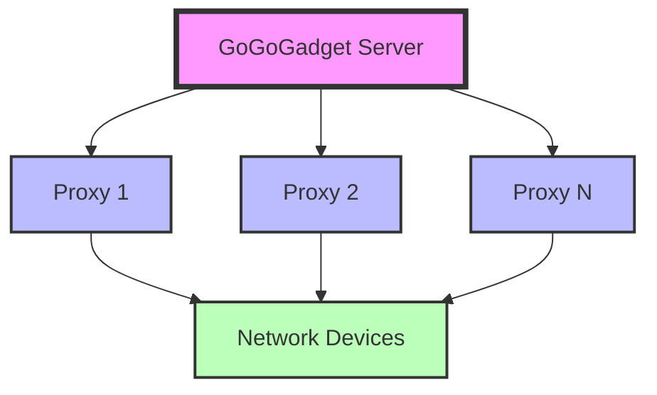
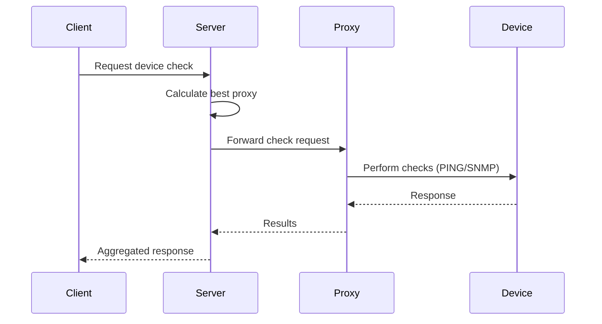
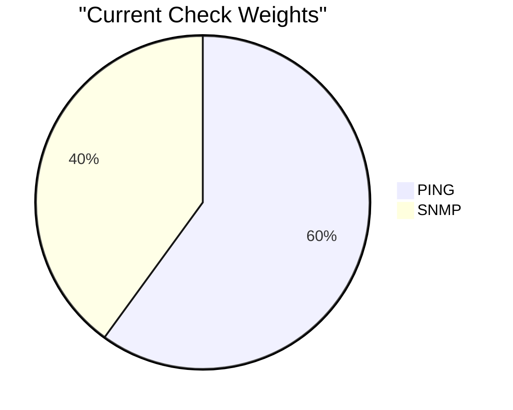
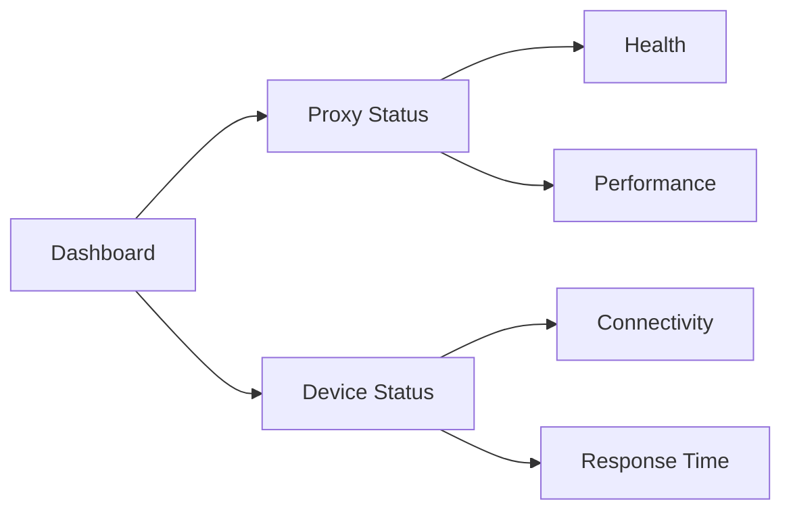

# GoGoGadget 🕵️‍♂️

[](https://github.com/XRP-Dad/go-go-gadget-umbrella)
[](https://github.com/XRP-Dad/go-go-gadget-umbrella)
[](https://github.com/XRP-Dad/go-go-gadget-umbrella/LICENSE)

> A distributed network monitoring and management tool inspired by Inspector Gadget! 🚀

## 📖 Overview

GoGoGadget is a powerful, distributed network monitoring system that helps you monitor and manage your network devices through multiple proxies. It currently supports PING and SNMP checks, with SSH and traceroute capabilities coming in future releases.



## ✨ Features

- 🌐 Distributed monitoring through multiple proxies
- 📊 Smart proxy selection based on performance
- 🔍 Current monitoring methods:
  - PING (latency measurement)
  - SNMP (v1 and v2c support)
- 🚀 Coming soon:
  - SSH (port availability)
  - Traceroute (path analysis)
- 🚦 Real-time status monitoring
- 📈 Performance scoring system
- 🔄 Automatic failover
- 🛡️ Error resilience

## 🚀 Quick Start

### Installation

1. Clone the repository:
```bash
git clone https://github.com/XRP-Dad/go-go-gadget-umbrella.git
cd go-go-gadget-umbrella
```

2. Run the installer:
```bash
chmod +x install_gogogadget.sh
./install_gogogadget.sh
```

3. Choose your installation type:
```
Please select installation type:
1) Server
2) Proxy
3) Uninstall
4) Cancel
```

### Configuration

The configuration files are located in `/opt/gogogadget/`:

- `constants.json`: Global configuration settings
- `server_config.json`: Server-specific configuration (for server installations)

Example `constants.json`:
```json
{
  "default_community": "public",
  "original_ping_weight": 0.6,
  "original_snmp_weight": 0.4,
  "max_ping_ms": 1000
}
```

## 📡 Usage Examples

### Simple Checks with the `/simplecheck` Endpoint (Now Fixed and Improved!)

The `/simplecheck` endpoint has been significantly improved and now correctly reports ping reachability status. Key improvements include:

- ✅ Properly reports ping reachability when any proxy has a successful ping
- ✅ Reports the lowest ping latency from all successful pings
- ✅ Performs local ping checks first before trying remote proxies
- ✅ More accurate best proxy selection based on enhanced scoring

You can use this endpoint with simple URL parameters:

1. **Basic Simple Check**
   ```bash
   # Using curl with the simplecheck endpoint:
   curl "http://localhost:8080/simplecheck?target=192.168.1.1&checks=ping,snmp&community=public"
   ```

2. **SNMP-Only Simple Check with SNMPv1**
   ```bash
   # Using curl with the simplecheck endpoint and SNMPv1:
   curl "http://localhost:8080/simplecheck?target=192.168.1.1&checks=snmp&community=public&snmp_version=v1"
   ```

3. **Ping-Only Simple Check**
   ```bash
   # Using curl for a ping-only check:
   curl "http://localhost:8080/simplecheck?target=192.168.1.1&checks=ping"
   ```

4. **Simple Check with Custom OIDs**
   ```bash
   # Using curl with specific OIDs:
   curl "http://localhost:8080/simplecheck?target=192.168.1.1&checks=snmp&community=public&oids=.1.3.6.1.2.1.1.5.0,.1.3.6.1.2.1.1.1.0"
   ```

### Simple Check Response

A successful simple check will return a response like this:

```json
{
  "best_proxy": "proxy1",
  "ping_reachable": true,
  "ping_latency_ms": 5.90414,
  "snmp_results": {
    ".1.3.6.1.2.1.1.1.0": "Device description here"
  }
}
```

The response will always include:
- `best_proxy`: The proxy that provided the best overall results
- `ping_reachable`: Now correctly shows `true` when any proxy had a successful ping
- `ping_latency_ms`: Reports the best (lowest) latency from all successful pings
- `snmp_results`: When SNMP check was requested and successful

### Simple Checks (JSON POST Method)

You can also use the `/check` endpoint with JSON POST for more detailed checks:

1. **Basic Simple Check**
   ```bash
   curl -X POST http://localhost:8080/check \
     -H "Content-Type: application/json" \
     -d '{
       "target": "192.168.1.1",
       "checks": ["ping", "snmp"],
       "community": "public"
     }'
   ```

2. **SNMP-Only Simple Check**
   ```bash
   curl -X POST http://localhost:8080/check \
     -H "Content-Type: application/json" \
     -d '{
       "target": "192.168.1.1",
       "checks": ["snmp"],
       "community": "public",
       "snmp_version": "v1"
     }'
   ```

3. **Ping-Only Simple Check**
   ```bash
   curl -X POST http://localhost:8080/check \
     -H "Content-Type: application/json" \
     -d '{
       "target": "192.168.1.1",
       "checks": ["ping"]
     }'
   ```

### Basic Device Check
```bash
# Using curl with JSON POST:
curl -X POST http://localhost:8080/check \
  -H "Content-Type: application/json" \
  -d '{
    "target": "192.168.1.1",
    "checks": ["ping", "snmp"],
    "community": "public",
    "snmp_version": "v2c"
  }'
```

### SNMP Monitoring with Custom OIDs
```bash
# Using curl with JSON POST and custom OIDs:
curl -X POST http://localhost:8080/check \
  -H "Content-Type: application/json" \
  -d '{
    "target": "192.168.1.1",
    "checks": ["ping", "snmp"],
    "community": "public",
    "snmp_version": "v1",
    "snmp_oids": [
      ".1.3.6.1.2.1.1.1.0",
      ".1.3.6.1.2.1.1.5.0"
    ]
  }'
```

### Fast SNMP Examples

1. **Default (v2c) SNMP Check**
   ```bash
   # Using curl for default v2c SNMP check:
   curl -X POST http://localhost:8080/check \
     -H "Content-Type: application/json" \
     -d '{
       "target": "192.168.1.1",
       "checks": ["snmp"],
       "community": "public"
     }'
   ```

2. **Force SNMPv1 Check**
   ```bash
   # Using curl to force SNMPv1:
   curl -X POST http://localhost:8080/check \
     -H "Content-Type: application/json" \
     -d '{
       "target": "192.168.1.1",
       "checks": ["snmp"],
       "community": "public",
       "snmp_version": "v1"
     }'
   ```

3. **Optimized SNMPv2c Check**
   ```bash
   # Using curl for optimized v2c with single OID:
   curl -X POST http://localhost:8080/check \
     -H "Content-Type: application/json" \
     -d '{
       "target": "192.168.1.1",
       "checks": ["snmp"],
       "community": "public",
       "snmp_version": "v2c",
       "snmp_oids": [".1.3.6.1.2.1.1.5.0"]
     }'
   ```

### SNMP Version Selection Tips

1. **Version Selection Strategy**
   - Use v2c by default (faster and more efficient)
   - Only specify v1 if device doesn't support v2c
   - Let the system auto-detect by omitting version

2. **Performance Considerations**
   ```bash
   # Fastest: Explicit v2c with single OID
   curl -X POST http://localhost:8080/check \
     -H "Content-Type: application/json" \
     -d '{
       "target": "192.168.1.1",
       "checks": ["snmp"],
       "community": "public",
       "snmp_version": "v2c",
       "snmp_oids": [".1.3.6.1.2.1.1.5.0"]
     }'
   
   # Slower: Auto-detect version
   curl -X POST http://localhost:8080/check \
     -H "Content-Type: application/json" \
     -d '{
       "target": "192.168.1.1",
       "checks": ["snmp"],
       "community": "public"
     }'
   
   # Slowest: Force v1
   curl -X POST http://localhost:8080/check \
     -H "Content-Type: application/json" \
     -d '{
       "target": "192.168.1.1",
       "checks": ["snmp"],
       "community": "public",
       "snmp_version": "v1"
     }'
   ```

### Request Examples by Speed

From fastest to slowest:

1. **Quickest Check (Ping Only)**
   ```bash
   # Fastest check option:
   curl -X POST http://localhost:8080/check \
     -H "Content-Type: application/json" \
     -d '{
       "target": "192.168.1.1",
       "checks": ["ping"]
     }'
   ```

2. **Fast SNMPv2c (Single OID)**
   ```bash
   # Fast SNMP check with single OID:
   curl -X POST http://localhost:8080/check \
     -H "Content-Type: application/json" \
     -d '{
       "target": "192.168.1.1",
       "checks": ["snmp"],
       "community": "public",
       "snmp_version": "v2c",
       "snmp_oids": [".1.3.6.1.2.1.1.5.0"]
     }'
   ```

3. **Standard Check (Ping + SNMPv2c)**
   ```bash
   # Standard ping + SNMP check:
   curl -X POST http://localhost:8080/check \
     -H "Content-Type: application/json" \
     -d '{
       "target": "192.168.1.1",
       "checks": ["ping", "snmp"],
       "community": "public",
       "snmp_version": "v2c"
     }'
   ```

4. **SNMPv1 Check**
   ```bash
   # SNMPv1 check:
   curl -X POST http://localhost:8080/check \
     -H "Content-Type: application/json" \
     -d '{
       "target": "192.168.1.1",
       "checks": ["snmp"],
       "community": "public",
       "snmp_version": "v1"
     }'
   ```

5. **Full Status Check**
   ```bash
   # System status check:
   curl "http://localhost:8080/status"
   ```

### Example Response

A successful check will return a response like this:

```json
{
  "snmp": {
    ".1.3.6.1.2.1.1.1.0": "Device description here"
  },
  "snmp_source": "proxy_hostname",
  "snmp_version": "v1",
  "results": [
    {
      "proxy_addr": "192.168.1.10",
      "proxy_hostname": "proxy1",
      "snmp_success": true,
      "snmp_results": {
        ".1.3.6.1.2.1.1.1.0": "Device description here"
      },
      "snmp_version": "v1",
      "score": 0.9
    }
  ],
  "best_proxy": "proxy1",
  "best_score": 0.9
}
```

### Speed Up SNMP Checks

1. **Use SNMPv2c When Possible**
   - SNMPv2c is more efficient than v1
   - Only fall back to v1 when necessary

2. **Minimize OIDs**
   - Request only needed OIDs
   - Use single OID for status checks

3. **Optimize Community Strings**
   - Use default community when possible
   - Keep community strings short

4. **Version Selection**
   - Explicitly set version to avoid auto-detection
   - Use v2c by default
   - Only use v1 when required

### Postman Examples

1. **Basic SNMP Check with Postman**
```json
POST http://localhost:8080/check
Content-Type: application/json

{
    "target": "192.168.1.1",
    "checks": ["ping", "snmp"],
    "community": "public",
    "snmp_oids": [
        ".1.2.840.10036.3.1.2.1.2.10",
        ".1.2.840.10036.3.1.2.1.3.10",
        ".1.3.6.1.4.1.41112.1.4.1.1.9.1"
    ],
    "snmp_version": "v1"
}
```

2. **Default SNMPv2c Check with Postman**
```json
POST http://localhost:8080/check
Content-Type: application/json

{
    "target": "192.168.1.1",
    "checks": ["ping", "snmp"],
    "community": "public",
    "snmp_oids": [
        ".1.3.6.1.2.1.1.1.0",  // sysDescr
        ".1.3.6.1.2.1.1.5.0"   // sysName
    ]
}
```

3. **System Status Check with Postman**
```json
GET http://localhost:8080/status
```

4. **Simple Check with Postman**
```json
POST http://localhost:8080/check
Content-Type: application/json

{
    "target": "192.168.1.1",
    "checks": ["snmp"],
    "community": "public",
    "snmp_version": "v1"
}
```

5. **SimpleCheck with Postman**
```
GET http://localhost:8080/simplecheck?target=192.168.1.1&checks=snmp&community=public&snmp_version=v1
```

## 🔄 Architecture



## 🎯 Performance Scoring

GoGoGadget uses a scoring system to determine the best proxy for each check:



## 🚀 Performance Optimization

### Fast Request Examples

1. **Fastest Single Device Check**
   ```bash
   # Quickest device check:
   curl -X POST http://localhost:8080/check \
     -H "Content-Type: application/json" \
     -d '{
       "target": "192.168.1.1",
       "checks": ["ping"]
     }'
   
   # Or with simplecheck:
   curl "http://localhost:8080/simplecheck?target=192.168.1.1&checks=ping"
   ```

2. **Fast SNMP Check**
   ```bash
   # Fast SNMP check with JSON:
   curl -X POST http://localhost:8080/check \
     -H "Content-Type: application/json" \
     -d '{
       "target": "192.168.1.1",
       "checks": ["snmp"],
       "community": "public",
       "snmp_oids": [".1.3.6.1.2.1.1.5.0"]
     }'
   
   # Or with simplecheck:
   curl "http://localhost:8080/simplecheck?target=192.168.1.1&checks=snmp&community=public&oids=.1.3.6.1.2.1.1.5.0"
   ```

3. **Fast Ping Check**
   ```bash
   # Fast ping check:
   curl -X POST http://localhost:8080/check \
     -H "Content-Type: application/json" \
     -d '{
       "target": "192.168.1.1",
       "checks": ["ping"]
     }'
   
   # Or with simplecheck:
   curl "http://localhost:8080/simplecheck?target=192.168.1.1&checks=ping"
   ```

### Request Speed Tips

1. **Use Simple URL Parameters for Fastest Results**
   ```bash
   # Fastest approach (if supported for your use case):
   curl "http://localhost:8080/simplecheck?target=192.168.1.1&checks=ping,snmp&community=public"
   ```

2. **Use JSON POST Format When More Control is Needed**
   ```bash
   # More control with JSON POST:
   curl -X POST http://localhost:8080/check \
     -H "Content-Type: application/json" \
     -d '{
       "target": "192.168.1.1",
       "checks": ["ping", "snmp"],
       "community": "public"
     }'
   ```

3. **Minimize Parameters**
   - Only include necessary parameters
   - Use default community string when possible
   - Skip optional parameters

4. **Choose Endpoints Wisely**
   ```bash
   # Fastest to slowest endpoints:
   /simplecheck          # Fastest - simple URL parameters
   /check               # Full check with proxy selection
   /status             # Complete system status
   ```

5. **Batch Requests When Possible**
   ```bash
   # Note: Batch processing with multiple targets is not currently implemented.
   # Instead, use individual requests for each target:
   
   # For the check endpoint:
   curl -X POST http://localhost:8080/check \
     -H "Content-Type: application/json" \
     -d '{
       "target": "192.168.1.1",
       "checks": ["ping", "snmp"],
       "community": "public"
     }'
   
   # For the simplecheck endpoint:
   curl "http://localhost:8080/simplecheck?target=192.168.1.1&checks=ping,snmp&community=public"
   ```

### Request Examples by Speed

From fastest to slowest:

1. **Quickest Check (Ping Only with SimpleCheck)**
   ```bash
   curl "http://localhost:8080/simplecheck?target=192.168.1.1&checks=ping"
   ```

2. **Fast SNMP (Single OID with SimpleCheck)**
   ```bash
   curl "http://localhost:8080/simplecheck?target=192.168.1.1&checks=snmp&community=public&oids=.1.3.6.1.2.1.1.5.0"
   ```

3. **Standard Check (Ping + SNMP with JSON POST)**
   ```bash
   curl -X POST http://localhost:8080/check \
     -H "Content-Type: application/json" \
     -d '{
       "target": "192.168.1.1",
       "checks": ["ping", "snmp"],
       "community": "public"
     }'
   ```

4. **Full Status Check**
   ```bash
   curl "http://localhost:8080/status"
   ```

## 🔧 Troubleshooting

### Common Issues

1. **Service Won't Start**
   ```bash
   # Check service status
   systemctl status gogogadget-server
   
   # Check logs
   journalctl -u gogogadget-server -n 50
   ```

2. **SNMP Checks Failing**
   - Verify SNMP community string
   - Check if SNMP is enabled on the target device
   - Ensure UDP port 161 is accessible

3. **Proxy Connection Issues**
   ```bash
   # Check proxy status
   curl http://localhost:8080/status
   
   # Test proxy connectivity
   telnet proxy_ip 8081
   ```

### Debug Mode

Enable debug logging by setting the environment variable:
```bash
export GOGOGADGET_DEBUG=1
systemctl restart gogogadget-server
```

## 🔍 Monitoring Dashboard

Access the monitoring dashboard at `http://localhost:8080/status` for a comprehensive view of your network:



## 📊 API Reference

| Endpoint | Method | Description |
|----------|--------|-------------|
| `/check` | POST | Perform device checks using JSON |
| `/simplecheck` | GET | Perform quick checks using URL parameters |
| `/status` | GET | Get system status |
| `/version` | GET | Get version info |

## 🗺️ Roadmap

- [ ] SSH connectivity checks
- [ ] Traceroute analysis
- [ ] Enhanced performance metrics
- [ ] Web-based dashboard
- [ ] SNMP v3 support
- [ ] Custom check plugins

## 🤝 Contributing

Contributions are welcome! Please read our [Contributing Guide](CONTRIBUTING.md) for details on our code of conduct and the process for submitting pull requests.

## 📝 License

This project is licensed under the MIT License - see the [LICENSE](LICENSE) file for details.

## 🙏 Acknowledgments

- Inspired by Inspector Gadget
- Built with Go
- Special thanks to all contributors

---

Made with ❤️ by the GoGoGadget Team 