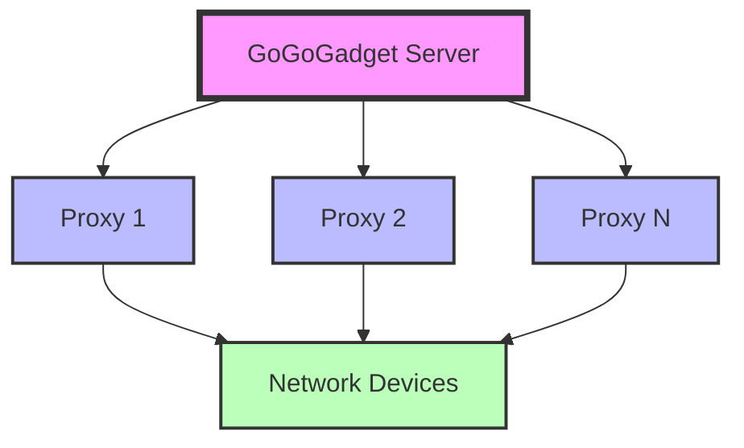
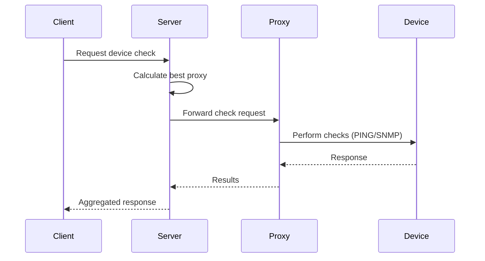
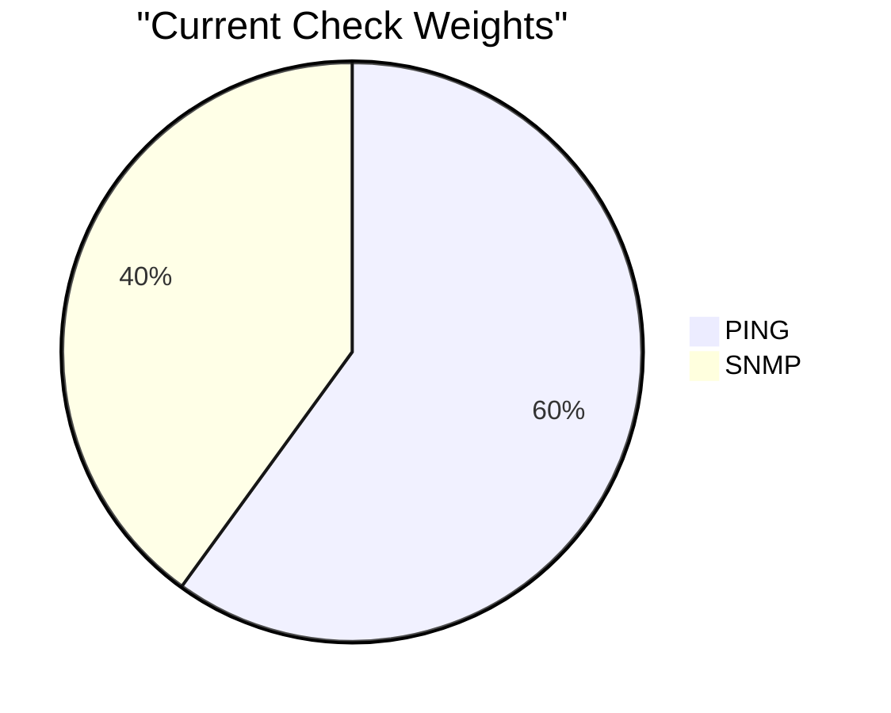
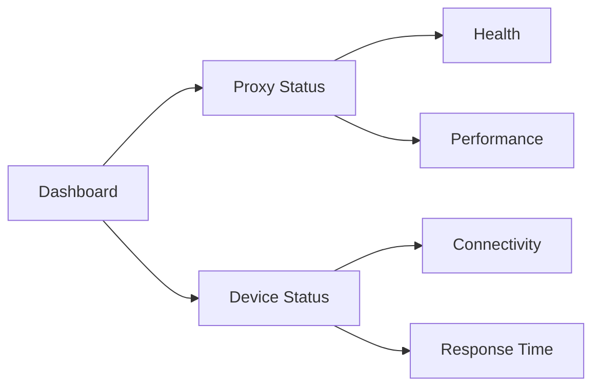

# GoGoGadget 🕵️‍♂️

[](https://github.com/XRP-Dad/go-go-gadget-umbrella)
[](https://github.com/XRP-Dad/go-go-gadget-umbrella)
[](https://github.com/XRP-Dad/go-go-gadget-umbrella/LICENSE)

> A distributed network monitoring and management tool inspired by Inspector Gadget! 🚀

## 📖 Overview

GoGoGadget is a powerful, distributed network monitoring system that helps you monitor and manage your network devices through multiple proxies. It currently supports PING and SNMP checks, with SSH and traceroute capabilities coming in future releases.



## ✨ Features

- 🌐 Distributed monitoring through multiple proxies
- 📊 Smart proxy selection based on performance
- 🔍 Current monitoring methods:
  - PING (latency measurement)
  - SNMP (v1 and v2c support)
- 🚀 Coming soon:
  - SSH (port availability)
  - Traceroute (path analysis)
- 🚦 Real-time status monitoring
- 📈 Performance scoring system
- 🔄 Automatic failover
- 🛡️ Error resilience

## 🚀 Quick Start

### Installation

1. Clone the repository:
```bash
git clone https://github.com/XRP-Dad/go-go-gadget-umbrella.git
cd go-go-gadget-umbrella
```

2. Run the installer:
```bash
chmod +x install_gogogadget.sh
./install_gogogadget.sh
```

3. Choose your installation type:
```
Please select installation type:
1) Server
2) Proxy
3) Uninstall
4) Cancel
```

### Configuration

The configuration files are located in `/opt/gogogadget/`:

- `constants.json`: Global configuration settings
- `server_config.json`: Server-specific configuration (for server installations)

Example `constants.json`:
```json
{
  "default_community": "public",
  "original_ping_weight": 0.6,
  "original_snmp_weight": 0.4,
  "max_ping_ms": 1000
}
```

## 📡 Usage Examples

### Basic Device Check
```bash
curl -X POST http://localhost:8080/check \
  -H "Content-Type: application/json" \
  -d '{
    "target": "192.168.1.1",
    "checks": ["ping", "snmp"],
    "community": "public"
  }'
```

### SNMP Monitoring with Custom OIDs
```bash
curl -X POST http://localhost:8080/check \
  -H "Content-Type: application/json" \
  -d '{
    "target": "192.168.1.1",
    "checks": ["ping", "snmp"],
    "community": "public",
    "snmp_oids": [
      ".1.3.6.1.2.1.1.1.0",
      ".1.3.6.1.2.1.1.5.0"
    ]
  }'
```

### Status Check
```bash
curl http://localhost:8080/status
```

## 🔄 Architecture



## 🎯 Performance Scoring

GoGoGadget uses a scoring system to determine the best proxy for each check:



## 🚀 Performance Optimization

### Fast Request Examples

1. **Fastest Single Device Check**
   ```bash
   # Quickest way to check a device
   curl "http://localhost:8080/simplecheck?target=192.168.1.1"
   ```

2. **Fast SNMP Check**
   ```bash
   # Only get system name - fastest SNMP check
   curl "http://localhost:8080/simplecheck?target=192.168.1.1&checks=snmp&oids=.1.3.6.1.2.1.1.5.0"
   ```

3. **Fast Ping Check**
   ```bash
   # Just ping check - fastest response
   curl "http://localhost:8080/simplecheck?target=192.168.1.1&checks=ping"
   ```

### Request Speed Tips

1. **Use GET Instead of POST**
   ```bash
   # Faster than POST
   curl "http://localhost:8080/simplecheck?target=192.168.1.1&checks=ping,snmp"
   
   # Slower POST version
   curl -X POST http://localhost:8080/check \
     -H "Content-Type: application/json" \
     -d '{
       "target": "192.168.1.1",
       "checks": ["ping", "snmp"]
     }'
   ```

2. **Minimize Parameters**
   - Only include necessary parameters
   - Use default community string when possible
   - Skip optional parameters

3. **Choose Endpoints Wisely**
   ```bash
   # Fastest to slowest endpoints:
   /simplecheck          # Fastest - direct check
   /check               # Full check with proxy selection
   /status             # Complete system status
   ```

4. **Use URL Parameters**
   ```bash
   # Good - fast URL parameters
   curl "http://localhost:8080/simplecheck?target=192.168.1.1&community=public"
   
   # Avoid - slower JSON body
   curl -X POST http://localhost:8080/check \
     -H "Content-Type: application/json" \
     -d '{
       "target": "192.168.1.1",
       "community": "public"
     }'
   ```

5. **Batch Requests When Possible**
   ```bash
   # Instead of multiple single requests, use comma-separated targets
   curl "http://localhost:8080/simplecheck?target=192.168.1.1,192.168.1.2,192.168.1.3"
   ```

### Request Examples by Speed

From fastest to slowest:

1. **Quickest Check (Ping Only)**
   ```bash
   curl "http://localhost:8080/simplecheck?target=192.168.1.1&checks=ping"
   ```

2. **Fast SNMP (Single OID)**
   ```bash
   curl "http://localhost:8080/simplecheck?target=192.168.1.1&checks=snmp&oids=.1.3.6.1.2.1.1.5.0"
   ```

3. **Standard Check (Ping + SNMP)**
   ```bash
   curl "http://localhost:8080/simplecheck?target=192.168.1.1"
   ```

4. **Full Status Check**
   ```bash
   curl "http://localhost:8080/status"
   ```

### Speed Up Checks

// ... rest of existing performance optimization content ...

## 🔧 Troubleshooting

### Common Issues

1. **Service Won't Start**
   ```bash
   # Check service status
   systemctl status gogogadget-server
   
   # Check logs
   journalctl -u gogogadget-server -n 50
   ```

2. **SNMP Checks Failing**
   - Verify SNMP community string
   - Check if SNMP is enabled on the target device
   - Ensure UDP port 161 is accessible

3. **Proxy Connection Issues**
   ```bash
   # Check proxy status
   curl http://localhost:8080/status
   
   # Test proxy connectivity
   telnet proxy_ip 8081
   ```

### Debug Mode

Enable debug logging by setting the environment variable:
```bash
export GOGOGADGET_DEBUG=1
systemctl restart gogogadget-server
```

## 🔍 Monitoring Dashboard

Access the monitoring dashboard at `http://localhost:8080/status` for a comprehensive view of your network:



## 📊 API Reference

| Endpoint | Method | Description |
|----------|--------|-------------|
| `/check` | POST | Perform device checks |
| `/status` | GET | Get system status |
| `/version` | GET | Get version info |
| `/simplecheck` | GET | Simple device check |

## 🗺️ Roadmap

- [ ] SSH connectivity checks
- [ ] Traceroute analysis
- [ ] Enhanced performance metrics
- [ ] Web-based dashboard
- [ ] SNMP v3 support
- [ ] Custom check plugins

## 🤝 Contributing

Contributions are welcome! Please read our [Contributing Guide](CONTRIBUTING.md) for details on our code of conduct and the process for submitting pull requests.

## 📝 License

This project is licensed under the MIT License - see the [LICENSE](LICENSE) file for details.

## 🙏 Acknowledgments

- Inspired by Inspector Gadget
- Built with Go
- Special thanks to all contributors

---

Made with ❤️ by the GoGoGadget Team 